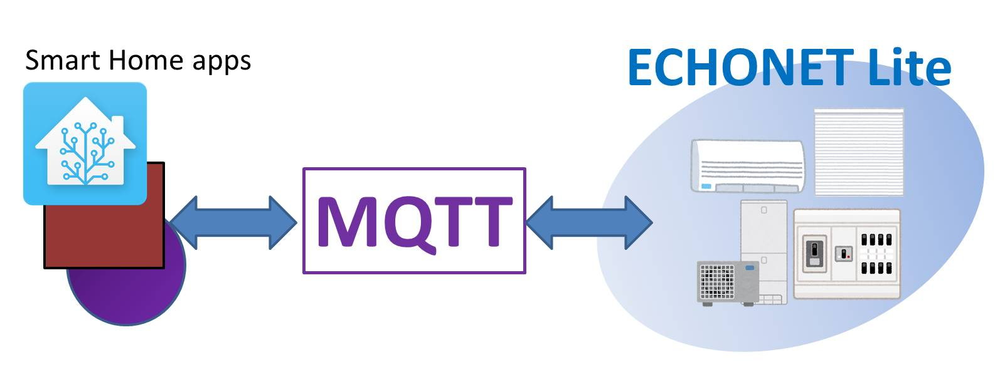
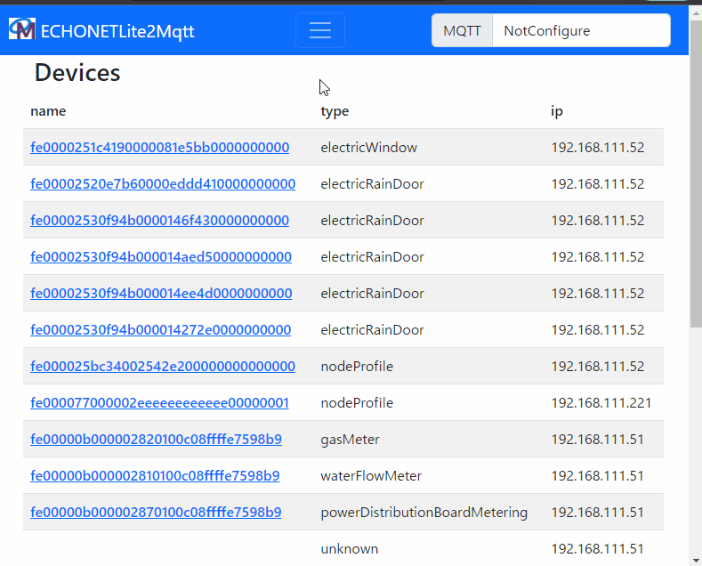

# ECHONETLite2MQTT

[](LICENSE)
[
](https://github.com/banban525/echonetlite2mqtt/actions/workflows/action.yml)
[
](https://github.com/banban525/echonetlite2mqtt/actions/workflows/test.yml)
[](https://hub.docker.com/r/banban525/echonetlite2mqtt)

ECHONET Lite と MQTT をつなぐブリッジです。

([Readme in English is here.](readme.md))

## 説明

このアプリケーションは、ECHONET Lite機器の情報をMQTTに送信し、MQTTからきたコマンドでECHONET Lite機器を操作します。
これによって、MQTTに対応したスマートホームアプリケーションからECHONET Lite機器を操作できるようになります。



サポートする機器は以下の通りです。
* 防犯センサ (0x0002)
* 非常ボタン (0x0003)
* 人体検知センサ (0x0007)
* 温度センサ (0x0011)
* 湿度センサ (0x0012)
* 風呂沸き上がりセンサ (0x0016)
* CO2センサ (0x001B)
* VOCセンサ (0x001D)
* 電力量センサ (0x0022)
* 電流センサ (0x0023)
* 照度センサ (0x00D0)
* 家庭用エアコン (0x0130)
* 換気扇 (0x0133)
* 空調換気扇 (0x0134)
* 空気清浄器 (0x0135)
* 業務用パッケージエアコン室内機 (設備用を除く) (0x0156)
* 業務用パッケージエアコン室外機 (設備用を除く) (0x0157)
* 電動ブラインド・日よけ (0x0260)
* 電動雨戸・シャッター (0x0263)
* 電動窓 (0x0265)
* 電気温水器 (0x026B)
* 電気錠 (0x026F)
* 瞬間式給湯器 (0x0272)
* 浴室暖房乾燥機 (0x0273)
* 住宅用太陽光発電 (0x0279)
* 冷温水熱源機 (0x027A)
* 床暖房 (0x027B)
* 燃料電池 (0x027C)
* 蓄電池 (0x027D)
* 電気自動車充放電器 (0x027E)
* 電力量メータ (0x0280)
* 水流量メータ (0x0281)
* ガスメータ (0x0282)
* 分電盤メータリング (0x0287)
* 低圧スマート電力量メータ (0x0288)
* 高圧スマート電力量メータ (0x028A)
* スマート電力量サブメータ (0x028D)
* 分散型電源電力量メータ (0x028E)
* 双方向対応高圧スマート電力量メータ (0x028F)
* 一般照明 (0x0290)
* 単機能照明 (0x0291)
* 電気自動車充電器 (0x02A1)
* 照明システム (0x02A3)
* 拡張照明システム (0x02A4)
* マルチ入力PCS (0x02A5)
* ハイブリッド給湯機 (0x02A6)
* 周波数制御 (0x02A7)
* 冷凍冷蔵庫 (0x03B7)
* クッキングヒータ (0x03B9)
* 炊飯器 (0x03BB)
* 業務用ショーケース (0x03CE)
* 洗濯乾燥機 (0x03D3)
* 業務用ショーケース向け室外機 (0x03D4)
* スイッチ (JEM-A/HA端子対応) (0x05FD)
* コントローラ (0x05FF)
* テレビ (0x0602)


## デモ




### [他のデモと設定例はこちらを見てください](demo/demo.md)

## 使い方

echonetlite2mqttは同じネットワーク内のデバイスを自動で見つけます。
そのため、デバイスと同じネットワークで実行する必要があります。
また、docker使用時は、 `--net=host` が必要です。


### Home AssistantのAddonとして使用する場合

以下のリンクからインストールできます。

   [](https://my.home-assistant.io/redirect/supervisor_add_addon_repository/?repository_url=https%3A%2F%2Fgithub.com%2Fzigbee2mqtt%2Fhassio-zigbee2mqtt)

詳細はこちらを参照してください: https://github.com/banban525/hassio-echonetlite2mqtt

### Dockerを使用する場合

1. 次のコマンドで起動します。
```
docker run -d --net=host -e MQTT_BROKER="mqtt://your.mqtt.brocker" banban525/echonetlite2mqtt 
```
2. ブラウザーで "http://(docker host):3000" を開くと、検出された機器とログを見ることができます。


### Node.jsを使用する場合

1. このリポジトリをクローンします。

```
git clone https://github.com/banban525/echonetlite2mqtt.git
```

2. リポジトリのルートディレクトリで以下のコマンドを実行して、初期設定を行います。

```
cd echonetlite2mqtt
npm install
```

3. 次のコマンドで起動します。

```
npm start -- --MqttBroker "mqtt://your.mqtt.brocker"
```

4. ブラウザーで "http://(docker host):3000" を開くと、検出された機器とログを見ることができます。


### 環境変数とコマンドライン引数

MQTT オプション

|  環境変数 | コマンドライン引数 | 説明 |
| ------------------     | --------------------- | ----------- |
|  `MQTT_BROKER`       | `--MqttBroker`     | MQTTブローカーのURLを指定します。"mqtt://" または "mqtts://"で始まる必要があります。  |
|  `MQTT_PORT`         | `--MqttPort`       | MQTTブローカーのポートNoを指定します。(デフォルト: 1883) |
|  `MQTT_CLIENT_ID`    | `--MqttClientId`   | MQTTのクライアントIDを指定します。 (Default: (空)) |
|  `MQTT_USERNAME`     | `--MqttUsername`   | MQTTのユーザー名を指定します。 (Default: (空))|
|  `MQTT_PASSWORD`     | `--MqttPassword`   | MQTTのパスワードを指定します。 (Default: (空))|
|  `MQTT_OPTION_FILE`  | `--MqttOptionFile` | MQTTのオプションファイルのパスを指定します。ファイルの形式は [MQTT.js](https://github.com/mqttjs/MQTT.js) の Client Options を参照してください。 (デフォルト: (空))  |
|  `MQTT_CA_FILE`      | `--MqttCaFile`     | MQTTの CA ファイルのパスを指定します。パスが指定されればロードして、MQTTのオプションの"ca"に設定されます。 (デフォルト: ロードしない)  |
|  `MQTT_CERT_FILE`    | `--MqttCertFile`   | MQTTの cert ファイルのパスを指定します。パスが指定されればロードして、MQTTのオプションの"cert"に設定されます。 (デフォルト: ロードしない)  |
|  `MQTT_KEY_FILE`     | `--MqttKeyFile`    | MQTTの key ファイルのパスを指定します。パスが指定されればロードして、MQTTのオプションの"key"に設定されます。 (デフォルト: ロードしない)  |
| `MQTT_BASE_TOPIC`    | `--MqttBaseTopic`  | MQTTトピックのプレフィックスを指定します。(デフォルト:"echonetlite2mqtt/elapi/v2/devices") |


REST API オプション

|  環境変数 | コマンドライン引数 | 説明 |
| ------------------     | --------------------- | ----------- |
| `REST_API_HOST` | `--RestApiHost` | 管理者ページのIPを指定します。複数のIPがある場合にこの設定が使用されます。(デフォルト: 0.0.0.0) |
| `REST_API_PORT` | `--RestApiPort` | 管理者ページのポートNoを指定します. (デフォルト: 3000) |
| `REST_API_ROOT` | `--RestApiRoot` | REST APIのURLのプレフィックスを指定します。 (Default: empty) |

ECHONET Lite オプション

|  環境変数 | コマンドライン引数 | 説明 |
| ------------------     | --------------------- | ----------- |
| `ECHONET_TARGET_NETWORK` | `--echonetTargetNetwork` | ECHONET Liteのネットワークを"000.000.000.000/00"の形で指定します。 (デフォルト: 自動) |
| `ECHONET_DEVICE_IP_LIST` | `--echonetDeviceIpList` | デバイスのIPをカンマ区切りで指定します。(デフォルト:無し) |
| `ECHONET_COMMAND_TIMEOUT` | `--echonetCommandTimeout` | ECHONET Liteコマンドの応答待ちの時間を指定します. (単位: ms) (デフォルト: 3000) |
| `ECHONET_DISABLE_AUTO_DEVICE_DISCOVERY` | `--echonetDisableAutoDeviceDiscovery` | デバイスの自動探索を無効にします。(デフォルト: off) |
| `ECHONET_ALIAS_FILE`   | `--echonetAliasFile`  | エイリアスオプションファイルを指定します。 (デフォルト: (空)) |
| `ECHONET_LEGACY_MULTI_NIC_MODE` | `--echonetLegacyMultiNicMode` | 以前の通信モードに戻します。 (デフォルト: off) |
| `ECHONET_UNKNOWN_AS_ERROR`   | `--echonetUnknownAsError`  | 不明なデバイスクラスや不明なプロパティをエラーとして扱います。 (デフォルト: off) |
| ~~`ECHONET_INTERVAL_TO_GET_PROPERTIES`~~ | ~~`--echonetIntervalToGetProperties`~~ | (v3.0.0以降で廃止されました) ~~ECHONET Liteプロパティの受信間隔を指定します。(単位: ms) (デフォルト: 100)~~ |
| ~~`ECHONET_ALT_MULTI_NIC_MODE`~~ | ~~`--echonetAltMultiNicMode`~~ | (v3.0.0以降で廃止されました) ~~複数NIC環境での代替モードです。もしデバイスから状態を受信できない場合は指定します。 (デフォルト: OFF)~~ |

### エイリアスオプションファイルの形式

`ECHONET_ALIAS_FILE` または `--echonetAliasFile` を使ってオプションファイルのパスを指定することで、
デバイスIdのエイリアスを指定することができます。

エイリアスオプションファイルは次の形式のJsonファイルです。

```
{
  "aliases":[
    {
      "name":"living_aircon",
      "eoj":"0130*",
      "ip":"192.168.1.48"
    },
    {
      "name":"bedroom_aircon",
      "id":"fe0000251c4190000081e5bb0000000000"
    }
  ]
}
```

|プロパティ| 説明 |
| -------- | ---------------- |
| name     | [必須] Idの代わりに付けるデバイスの名前 |
| ip       | デバイスを特定するためのIpアドレス。 ワイルドカードとして `*` が使用可能です。 |
| eoj      | デバイスを特定するためのECHONET LiteのオブジェクトId。 ワイルドカードとして `*` が使用可能です。 |
| id       | デバイスを特定するためのId。 ワイルドカードとして `*` が使用可能です。 |

ip、eoj、idの条件をすべてみたした場合に、エイリアスが採用されます。
複数マッチした場合は先頭が優先されます。


## ver.1.x から ver.2.x へのマイグレーション

ver.1.x から ver.2.xの主な変更点は以下です。

* (1) デフォルトのMQTTトピックが、"echonetlite2mqtt/elapi/v1" から "echonetlite2mqtt/elapi/v2" に変わりました。
* (2) 一部の機器でIdが変更になりました。
* (3) "schema"の仕様が変わりました。
* (4) Web UIが再構築されました。

できるだけ、ver.1.xとの互換性を保ちたい場合、(1)の対応には`MQTT_BASE_TOPIC` (または `--MqttBaseTopic` )を、
(2)の対応には、`ECHONET_ALIAS_FILE` ( または `--echonetAliasFile` ) を使ってください。

```
docker run -d --net=host -e MQTT_BROKER="mqtt://your.mqtt.brocker" -e MQTT_BASE_TOPIC="echonetlite2mqtt/elapi/v1/devices" -e ECHONET_ALIAS_FILE=/app/configure/alias.json -v (some folder):/app/configure banban525/echonetlite2mqtt 

or 

npm start -- --MqttBroker "mqtt://your.mqtt.brocker" --MqttBaseTopic "echonetlite2mqtt/elapi/v1/devices" --echonetAliasFile ./alias.json
```


## FAQ

### プロパティが自動で更新されない

#### (1) 複数のIPがある環境だと正常に動作しないことがあります。

もし実行環境に複数のIPがある場合、 `ECHONET_TARGET_NETWORK` と `ECHONET_ALT_MULTI_NIC_MODE` を試してみてください。
(Node.jsを使用している場合は `--echonetTargetNetwork` と `--echonetAltMultiNicMode`)

* Dockerの場合: `-e ECHONET_TARGET_NETWORK="192.168.1.0/24" -e ECHONET_ALT_MULTI_NIC_MODE=1`
* Node.jsの場合: `--echonetTargetNetwork "192.168.1.0/24" --echonetAltMultiNicMode`

#### (2) ECHONET Lite 機器が自動でプロパティを送らないのかも

Web UIからプロパティを更新することができます。
Web UIで更新できるなら、MQTTトピックを送ることで手動で更新することができます。

例えば、エアコンの室温を更新したい場合、次のMQTTトピックを送ります。
("fe00-your-device-id-00000000000000"はデバイスIdに変更してください)
```
echonetlite2mqtt/elapi/v2/devices/fe00-your-device-id-00000000000000/properties/roomTemperature/request
```

### エアコンの設定温度を0.5度単位で指定したい

ECHONET Liteの「温度設定値」が1度単位なので対応できません。

以下の仕様書に記載されています。
* (日本語) https://echonet.jp/spec_g/#standard-05
* (英語) https://echonet.jp/spec-en/#standard-05

### デバイスの定義を追加したい

ECHONETLite2MQTTはデバイス定義として [Echonet lite Machine Readable Appendix (MRA)](https://echonet.jp/spec_mra_rr3/) を使用しています。
しかし、MRAにないデバイスクラス、またはメーカー独自の拡張を使用したい場合があります。
"MRA_custom"フォルダにeoj名のJsonファイルを作ると、MRAの定義を上書きすることができます。

例: エアコン(eoj=0x0130)の場合
```
/MRA_custom/0x0130.json

{
  "eoj": "0x0130"
  ...
}

```

ファイルフォーマットは、 [Echonet lite Machine Readable Appendix (MRA)](https://echonet.jp/spec_mra_rq1/) を参考にしてください。
また、 "MraTypes.schema.json" にJson Schemaが用意されています。


## 使用しているサードパーティ

* リポジトリ内の画像は"いらすとや" (https://www.irasutoya.com/) の素材を使用しています。
* ECHONET Liteの定義は Machine Readable Appendix (MRA) Version 1.3.1 (https://echonet.jp/spec_mra_rr3/) を使用しています。

## ライセンス

[MIT](LICENSE)

## Author

[banban525](https://github.com/banban525)

