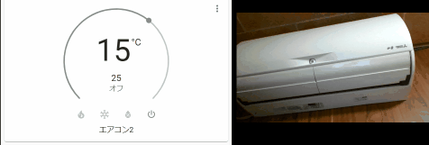
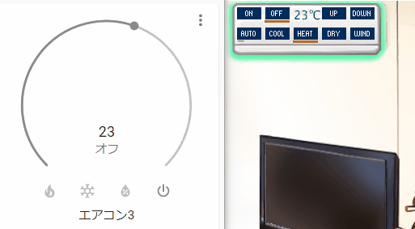
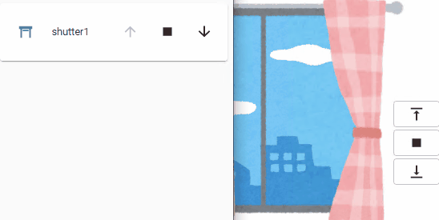
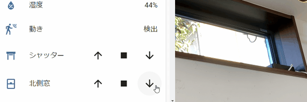
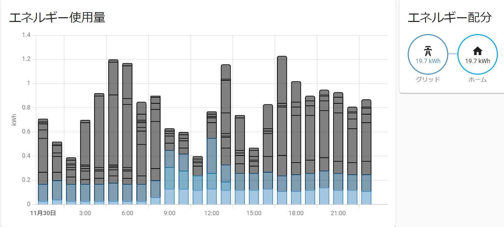
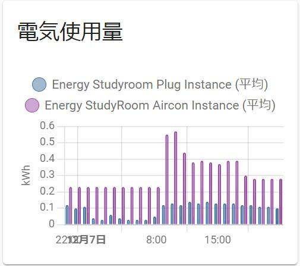
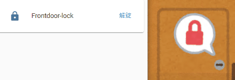

# Demo movies and settings examples

## Air conditioner ([Daikin AN-22YRS-W](https://www.ac.daikin.co.jp/roomaircon/2021/products/r_series))


### settings examples for Home Assistant

```yml
mqtt:
  climate:
    - name: "air-conditioner"
      icon: mdi:air-conditioner
      modes:
        - "off"
        - "cool"
        - "heat"
        - "dry"
        - "auto"
      mode_command_template: >-
        
        {{ values[value] if value in values.keys() else 'off' }}
      payload_on: "true"
      payload_off: "false"
      power_command_topic: "echonetlite2mqtt/elapi/v2/devices/fe00-your-device-id-00000000000000/properties/operationStatus/set"
      mode_command_topic: "echonetlite2mqtt/elapi/v2/devices/fe00-your-device-id-00000000000000/properties/operationMode/set"
      temperature_state_topic: "echonetlite2mqtt/elapi/v2/devices/fe00-your-device-id-00000000000000/properties/targetTemperature"
      temperature_command_topic: "echonetlite2mqtt/elapi/v2/devices/fe00-your-device-id-00000000000000/properties/targetTemperature/set"
      current_temperature_topic: "echonetlite2mqtt/elapi/v2/devices/fe00-your-device-id-00000000000000/properties/roomTemperature"
      mode_state_topic: "echonetlite2mqtt/elapi/v2/devices/fe00-your-device-id-00000000000000/properties"
      mode_state_template: >-
        
          off
        
          
          {{ values[value_json.operationMode] if value_json.operationMode in values.keys() else 'off' }}
        
```


## Air conditioner ([Mitsubishi MSZ-X255-W](https://www.mitsubishielectric.co.jp/ldg/wink/ssl/displayProduct.do?pid=251963&ccd=1040105711) with [MAC-900IF](https://www.mitsubishielectric.co.jp/ldg/wink/ssl/displayProduct.do?pid=310070))



### settings examples for Home Assistant

```yml
climate:
  - platform: mqtt
    name: air-conditioner
    icon: mdi:air-conditioner
    modes:
      - "off"
      - "cool"
      - "heat"
      - "dry"
    mode_command_template: >-
      
      {{ values[value] if value in values.keys() else 'off' }}
    payload_on: "true"
    payload_off: "false"
    power_command_topic: "echonetlite2mqtt/elapi/v2/devices/fe00-your-device-id-00000000000000/properties/operationStatus/set"
    mode_command_topic: "echonetlite2mqtt/elapi/v2/devices/fe00-your-device-id-00000000000000/properties/operationMode/set"
    temperature_state_topic: "echonetlite2mqtt/elapi/v2/devices/fe00-your-device-id-00000000000000/properties/targetTemperature"
    temperature_command_topic: "echonetlite2mqtt/elapi/v2/devices/fe00-your-device-id-00000000000000/properties/targetTemperature/set"
    current_temperature_topic: "echonetlite2mqtt/elapi/v2/devices/fe00-your-device-id-00000000000000/properties/roomTemperature"
    mode_state_topic: "echonetlite2mqtt/elapi/v2/devices/fe00-your-device-id-00000000000000/properties"
    mode_state_template: >-
      
        off
      
        
        {{ values[value_json.operationMode] if value_json.operationMode in values.keys() else 'off' }}
      
```


## Air conditioner (Simulator [moekaden](https://github.com/SonyCSL/MoekadenRoom))



### settings examples for Home Assistant

```yml
climate:
  - platform: mqtt
    name: air-conditioner
    icon: mdi:air-conditioner
    modes:
      - "off"
      - "cool"
      - "heat"
      - "dry"
    mode_command_template: >-
      
      {{ values[value] if value in values.keys() else 'off' }}
    payload_on: "true"
    payload_off: "false"
    power_command_topic: "echonetlite2mqtt/elapi/v2/devices/fe00-your-device-id-00000000000000/properties/operationStatus/set"
    mode_command_topic: "echonetlite2mqtt/elapi/v2/devices/fe00-your-device-id-00000000000000/properties/operationMode/set"
    temperature_state_topic: "echonetlite2mqtt/elapi/v2/devices/fe00-your-device-id-00000000000000/properties/targetTemperature"
    temperature_command_topic: "echonetlite2mqtt/elapi/v2/devices/fe00-your-device-id-00000000000000/properties/targetTemperature/set"
    current_temperature_topic: "echonetlite2mqtt/elapi/v2/devices/fe00-your-device-id-00000000000000/properties/roomTemperature"
    mode_state_topic: "echonetlite2mqtt/elapi/v2/devices/fe00-your-device-id-00000000000000/properties"
    mode_state_template: >-
      
        off
      
        
        {{ values[value_json.operationMode] if value_json.operationMode in values.keys() else 'off' }}
      
```


## Electric shutter ([LIXIL electric window shutter](https://www.lixil.co.jp/lineup/window/jshutter/))


### settings examples for Home Assistant

```yml
mqtt:
  cover:
    - name: shutter1
      unique_id: shutter1
      command_topic: "echonetlite2mqtt/elapi/v2/devices/fe00-your-device-id-00000000000000/properties/openCloseOperation/set"
      device_class: shutter
      payload_close: "close"
      payload_open: "open"
      payload_stop: "stop"
      state_closed: "fullyClosed"
      state_closing: "closing"
      state_open: "fullyOpen"
      state_opening: "opening"
      state_stopped: "stoppedHalfway"
      state_topic: "echonetlite2mqtt/elapi/v2/devices/fe00-your-device-id-00000000000000/properties/openCloseStatus"
      optimistic: true
```


## Electric shutter (Simulator [echonet-lite-kaden-emulator](https://github.com/banban525/echonet-lite-kaden-emulator))



### settings examples for Home Assistant

```yml
cover:
  - platform: mqtt
    command_topic: "echonetlite2mqtt/elapi/v2/devices/fe00-your-device-id-00000000000000/properties/openCloseOperation/set"
    device_class: shutter
    name: shutter1
    payload_close: "close"
    payload_open: "open"
    payload_stop: "stop"
    state_closed: "fullyClosed"
    state_closing: "closing"
    state_open: "fullyOpen"
    state_opening: "opening"
    state_stopped: "stoppedHalfway"
    state_topic: "echonetlite2mqtt/elapi/v2/devices/fe00-your-device-id-00000000000000/properties/openCloseStatus"
```


## Electric Window ([LIXIL Electric Window](https://www.lixil.co.jp/lineup/window/s/electric-items/))




### settings examples for Home Assistant

```yml
mqtt:
  cover:
    - name: window1
      unique_id: window1
      command_topic: "echonetlite2mqtt/elapi/v2/devices/fe00-your-device-id-00000000000000/properties/openCloseOperation/set"
      device_class: window
      payload_close: "close"
      payload_open: "open"
      payload_stop: "stop"
      state_closed: "fullyClosed"
      state_closing: "closing"
      state_open: "fullyOpen"
      state_opening: "opening"
      state_stopped: "stoppedHalfway"
      state_topic: "echonetlite2mqtt/elapi/v2/devices/fe00-your-device-id-00000000000000/properties/openCloseStatus"
      optimistic: true
```


## Electric Water Heater ([Mitsubishi electric water heater SRT-S375A](https://www.mitsubishielectric.co.jp/ldg/wink/ssl/displayProduct.do?pid=309056&ccd=10501120) with [GT-HEM4](https://www.mitsubishielectric.co.jp/ldg/wink/ssl/displayProduct.do?pid=309179&ccd=10501170) )


### settings examples for Home Assistant

```yml
mqtt:
  sensor:
   - name: "WaterHeater_Remains"
     state_topic: "echonetlite2mqtt/elapi/v2/devices/fe00-your-device-id-00000000000000/properties/remainingWater"
     unit_of_measurement: "L"
     icon: mdi:water-boiler
   - name: "WaterHeater_State"
     state_topic: "echonetlite2mqtt/elapi/v2/devices/fe00-your-device-id-00000000000000/properties/bathOperationStatusMonitor"
  switch:
    - name: "WaterHeater_Auto"
      unique_id: waterHeater_auto
      state_topic: "echonetlite2mqtt/elapi/v2/devices/fe00-your-device-id-00000000000000/properties"
      value_template: >-
        
          false
        
          true
        
      command_topic: "echonetlite2mqtt/elapi/v2/devices/fe00-your-device-id-00000000000000/properties/automaticBathOperation/set"
      payload_on: "true"
      payload_off: "false"
      state_on: "true"
      state_off: "false"
      optimistic: false
      qos: 0
      retain: false
```


## Power Distribution Board Metering ([Panasonic BHM87261B2](https://www2.panasonic.biz/scvb/a2A/opnItemDetail?use_obligation=scva&contents_view_flg=1&catalog_view_flg=1&item_cd=BHM87261B2&item_no=BHM87261B2&b_cd=301&hinban_kbn=1&s_hinban_key=BHM87261B2&s_end_flg=&vcata_flg=1))

 


### settings examples for Home Assistant

```yml
mqtt:
  sensor:
   - name: "energy channel 1"
     unique_id: energy_channel1
     state_topic: "echonetlite2mqtt/elapi/v2/devices/fe00-your-device-id-00000000000000/properties/measurementChannel1"
     unit_of_measurement: "kWh"
     value_template: "{{ value_json.electricEnergy * 0.01 }}"
     state_class: "total_increasing"
     device_class: "energy"
   - name: "Energy StudyRoom Aircon"
     unique_id: energy_channel2
     state_topic: "echonetlite2mqtt/elapi/v2/devices/fe00-your-device-id-00000000000000/properties/measurementChannel2"
     unit_of_measurement: "kWh"
     value_template: "{{ value_json.electricEnergy * 0.01 }}"
     state_class: "total_increasing"
     device_class: "energy"
     // ... and more
sensor:
 - platform: statistics
   unique_id: energy_channel1_instantaneous
   name: "energy channel 1"
   entity_id: sensor.energy_channel1
   state_characteristic: change
   sampling_size: 2
   precision: 2
 - platform: statistics
   unique_id: energy_channel2_instantaneous
   name: "energy channel 2"
   entity_id: sensor.energy_channel2
   state_characteristic: change
   sampling_size: 2
   precision: 2
   // ... and more

```


## JEM-A / HA terminal compatible switch (Simulator [echonet-lite-kaden-emulator](https://github.com/banban525/echonet-lite-kaden-emulator))




### settings examples for Home Assistant

```yml
lock:
  - platform: mqtt
    name: Frontdoor-lock
    state_topic: "echonetlite2mqtt/elapi/v2/devices/fe00-your-device-id-00000000000000/properties/operationStatus"
    command_topic: "echonetlite2mqtt/elapi/v2/devices/fe00-your-device-id-00000000000000/properties/operationStatus/set"
    payload_lock: "false"
    payload_unlock: "true"
    state_locked: "false"
    state_unlocked: "true"
    optimistic: false
    qos: 1
    retain: true
```

